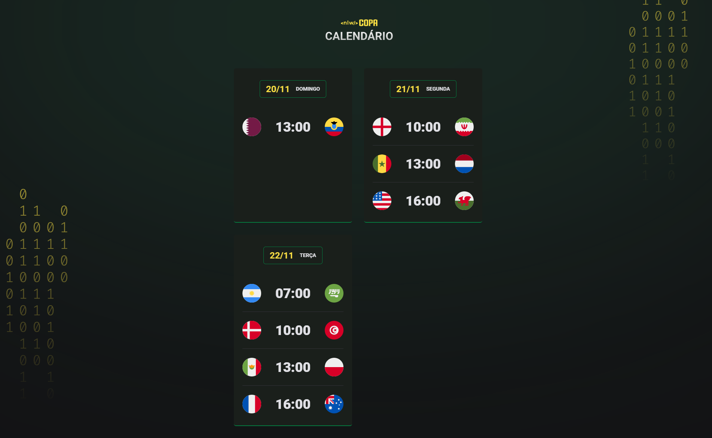

<h1 align="center">Calendário da Copa 2022</h1>

Evento exclusivo e gratuito, promovido pela <a href="https://www.rocketseat.com.br/">@Rocketseat</a> para ensino de tecnologias WEB.

  <a href="#📋-descrição-do-projeto-memo">Descrição</a>&nbsp;&nbsp;&nbsp;|&nbsp;&nbsp;&nbsp;
  <a href="#🤖-protótipo-memo">Protótipo</a>&nbsp;&nbsp;&nbsp;|&nbsp;&nbsp;&nbsp;
  <a href="#🛠️-tecnologias-memo">Tecnologias</a>&nbsp;&nbsp;&nbsp;|&nbsp;&nbsp;&nbsp;
  <a href="#📃-licença-memo">Licença</a>&nbsp;&nbsp;&nbsp;|&nbsp;&nbsp;&nbsp;
  <a href="#📩-contato-memo">Contato</a>

  

 

---

## 📋 Descrição do projeto :memo:

O <strong>calendário da copa 2022</strong> foi desenvolvido na versão <em>mobile</em> e depois adaptado para versão <em>desktop</em>. Este projeto foi construído inteiramente com as linguagens <em><strong>HTML</strong></em>, <em><strong>CSS</strong></em> e <em><strong>JavaScript</strong></em>.

> HTML:
- Tags de texto;
- Tags semânticas;
- Tags de midias e seus atributos de acessibilidade.
 
> CSS:
- Pseudo-classes;
- Propriedades de posicionamento; 
- Modo de exibição dos elementos;
- Variáveis;
- Estilização de bordas;
- Transformações de textos;
- Seletores e suas combinações;
- Propriedades de alinhamento e espaçamento dos elementos;
- Animações e transições;
- Propriedades de responsividade;
- At-rules.

> JavaScript:
- Funções;
- Variáveis;
- Criação de elementos <em>HTML</em> dinamicamente com <em>JS</em>;
- Uso de template literals.

---

## 🤖 Protótipo :memo:

🔗 [Clique aqui para acessar](https://nathxrz.github.io/nlw-copa22/)
 
---

## 🛠️ Tecnologias :memo:
- HTML;
- CSS;
- JS.

---

## 📃 Licença :memo:

Esse projeto está sob a licença MIT.

---

## 📩 Contato :memo:
> 📧 nathyrezendemachado@gmail.com  
> 💼 <a href="https://www.linkedin.com/in/nathalia-machado-021b1b230/"> LinkedIn</a>  

---

<h4 align="center">
    Feito com ♥ by Rocketseat <a href="https://discord.gg/rocketseat">Participe da nossa comunidade!</a>
</h4>
    